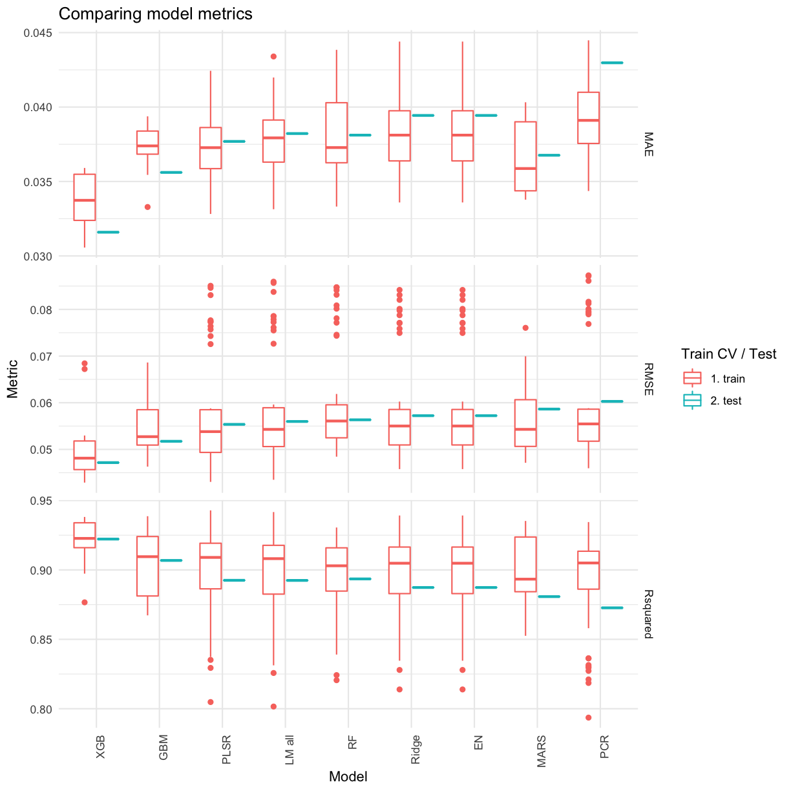

# CaretMisc
Miscellaneous Functions To Make Caret Easier in R

Installation instructions:
``` R
install.packages("devtools") 
devtools::install_github("gdmcdonald/CaretMisc")
```


So you can do things like this:


Make a list of your trained caret models, and then evaluate them against each other on the train and test sets.

``` R
allModels <- list(
  "Ridge" = ames_ridge,
  "Lasso" = ames_lasso, 
  "EN" = ames_en,
  "PLSR" = ames_plsr, 
  "PCR" = ames_pcr,
  "MARS" = ames_mars,
  "LM all" = ames_lm_all
)

p <- compareModels(model_list = allModels,
                   test_data = test_set,
                   model_order = "RMSE")
p
```


